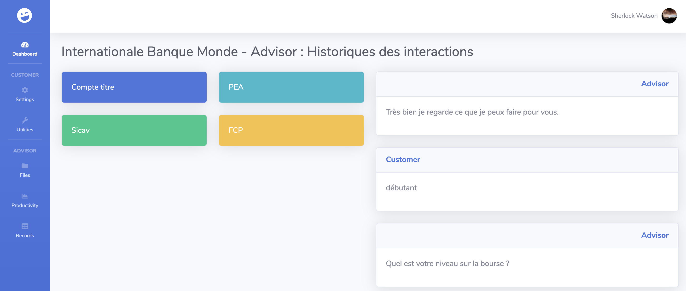

# Voicebot using IBM Watson services

This application demonstrates a voicebot using IBM Watson services, on a Node.js web application based on the Express framework.

## Run the app locally

1. [Install Node.js][]
1. cd into this project's root directory
1. copy the .env.example file to an .env file and add your credentials
1. Run `npm install` to install the app's dependencies
1. Run `npm start` to start the app
1. Access the running app in a browser at <http://localhost:6001>

### Open the 3 web pages :

- localhost:6001/advisor   
This page will be used to follow the conversation with the advisor

- localhost:6001/phone  
This page will be used to start the call

- localhost:6001/control  
This page will be used to record your voice input

[Install Node.js]: https://nodejs.org/en/download/
